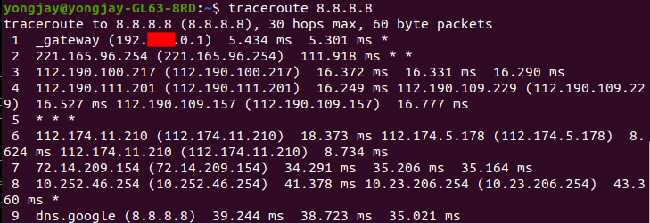
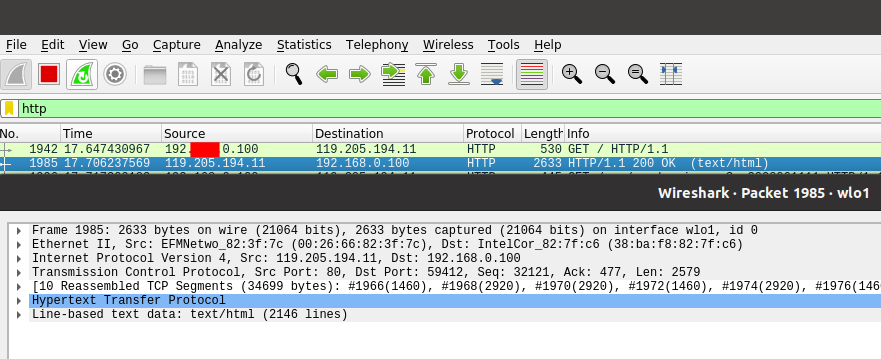

## 네트워크란 무엇인가?

노드들이 데이터를 공유할 수 있게 하는 디지털 전기 통신망의 하나.

즉, 분산되어 있는 컴퓨터를 통신망으로 연결한 것을 말한다.

인터넷이란?

: 문서, 그림 영상과 같은 여러 데이터를 공유하도록 구성된 세상에서 가장 큰 전세계를 연결하는 네트워크

\*WWW: 인터넷을 통해 웹 관련 데이터를 공유하는 것

## 네트워크의 분류

### 크기에 따른 분류

1. LAN(Local Area Network): 가까운 지역을 하나로 묶은 네트워크
1. WAN(Wide Area Network): 가까운 지역끼리 묶인 LAN 과 LAN 을 다시 하나로 묶은 것

### 연결 형태에 따른 분류

1. 중앙 장비에 모든 노드가 연결된 Star 형: LAN 대역을 만들때 많이 쓰임
2. 여러 노드들이 서로 그물처럼 연결된 Mesh 형: 하나의 연결이 끊어지더라도 큰 문제 없음.
3. 실제 인터넷은 여러 형태를 혼합한 형태, 혼합형: 여러 Star 형을 묶는 Mesh 형

### 네트워크에서 데이터는 어떻게 주고 받는가?

1. 유니 캐스트: 특정 대상이랑만 1:1 통신
2. 멀티 캐스트: 특정 다수와 1:N 으로 통신
3. 브로드 캐스트: 네트워크에 있는 모든 대상과 통신

### 네트워크에 있는 특정한 사용자를 어떻게 찾아낼까?

프로토콜: 일종의 약속. 네트워크에서 노드와 노드가 통신할 때 어떤 노드가 어떤 노드에게 어떤 데이터를 어떻게 보내는지 작성하기 위한 양식

- 가까운 곳과 연락할때: Ethernet 프로토콜(MAC 주소)
- 멀리 있는 곳과 연락할 때: ICMP, IPv4, ARP(IP주소)
- 여러가지 프로그램으로 연락할 때: TCP, UDP(포트번호)

실제로는 여러 프로토콜들로 캡슐화 된 패킷을 사용한다.

## 실습

### traceroute 로 구글에 가기까지 거쳐간 네트워크 대역대 확인하기

star : IP 주소 공개 안함

네트워크 대역 들을 넘어갈 때마다 표시. 구글까지 찾아갈 때 총 9개의 네트워크 대역들을 거쳐간 것이다.

192.\*\*\*.0.1 : 본인이 사용하고 있는 네트워크

### Wireshark 로 프로토콜 캡쳐 후 확인해보기

- Ethernet: 전세계의 사무실이나 가정에서 일반적으로 사용되는 LAN에서 가장 많이 활용되는 기술 규격
- Internet Protocol: 송신 호스트와 수신 호스트가 패킷 교환 네트워크(패킷 스위칭 네트워크, Packet Switching Network)에서 정보를 주고받는 데 사용하는 정보 위주의 규약
- Transmission Control Protocol: 웹 브라우저들이 월드 와이드 웹에서 서버에 연결할 때 사용되며, 이메일 전송이나 파일 전송에도 사용된다.
- Hypertext Transfer Protocol: HTML 문서를 주고받는 데에 쓰인다.  
   
  SOURCE: [따라하면서 배우는 IT 네트워크 기초](https://www.youtube.com/watch?v=Av9UFzl_wis&list=PL0d8NnikouEWcF1jJueLdjRIC4HsUlULi&index=1)
